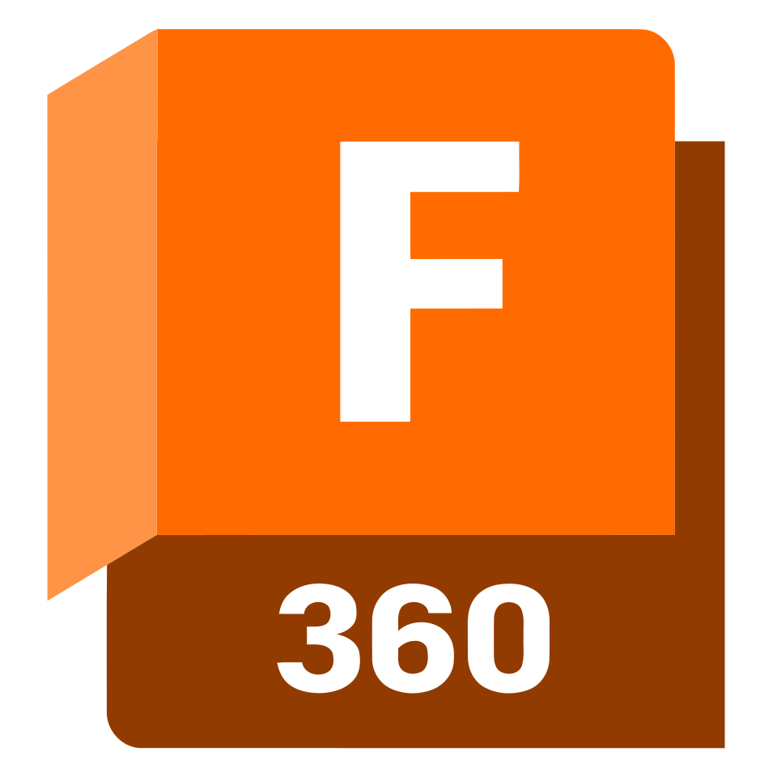
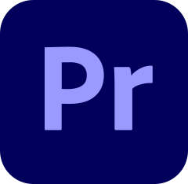

<h1 align="center">Hi 👋, I'm Tomek</h1>
<h3 align="center">A passionate maker and developer.</h3>

    <table>
        <tr>
            <td>
                <ul>
                    <li>🎓 I am currently studying **Automatic Control and Robotics**</li>
                    <li>📝 I Am Currently working on <a href="https://github.com/DrSapling/Nilesoft-Shell-Configurator">Nilesoft Shell Configurator</a></li>
                    <li>💪 In Free time I enjoy cycling (beside games 😅)</li>
                </ul>
            </td>
        </tr>
    </table>

---

<h2 align="center">Languages and software I have experience with:</h3>

    
    
    
    
    
    
     
    
     
     
    
    
    
    
    
    
    
     
    
    
     
     
    
    

---